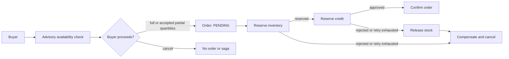

# Arbitrier

Arbitrier is a B2B bulk-order orchestration reference system built with Java 25, Spring Boot 4.1, PostgreSQL, Kafka/Avro, Keycloak, and React. It makes inventory reservation, credit approval, compensation, retries, and customer-facing outcomes explicit across independently owned bounded contexts.

The current repository contains a tested backend domain/application core, JPA persistence adapters, a mock-backed Customer Portal prototype, and a reproducible local infrastructure stack. Kafka runtime consumers, complete production messaging, database migrations, and deployed cloud infrastructure remain roadmap work.

## UC-01: Corporate Bulk Order

The buyer first performs a non-binding global availability check. Inventory—not the buyer, Order, or Saga—chooses warehouses and may allocate one requested line across multiple locations. If availability is partial, the buyer resolves that choice before submission; the saga never waits indefinitely for a customer decision.



The implemented saga terminal states are `COMPLETED`, `CANCELLED`, and `FAILED_COMPENSATION`. Customer-facing order outcomes are `CONFIRMED`, `PARTIALLY_CONFIRMED`, or `CANCELLED`. The retry policy decides `RETRY` versus `EXHAUST` from attempt counts; scheduling durations and Resilience4j runtime wiring are separate concerns.

## Architecture

Each business service uses hexagonal architecture. Domain models are immutable, pure Java, and independent of Spring/JPA/Kafka. Application services own transaction boundaries; repository adapters map aggregates to separate JPA entities and Spring Data repositories. Aggregate roots use optimistic locking.

| Module | Ownership | Current implementation |
|---|---|---|
| `order-service` | Order lifecycle and authenticated saga entry | REST submission, JWT resource-server security, pre-saga negotiation, Order JPA adapter, conditional Kafka `OrderCreated` publisher foundation |
| `inventory-service` | Global availability, warehouse allocation, reservations and release | Multi-warehouse allocation domain, application services, Stock Reservation JPA adapter; runtime inbound/Kafka adapters pending |
| `credit-service` | Credit reservation and release | Domain/application services and Credit Reservation JPA adapter; external credit-limit and Kafka adapters pending |
| `orchestrator-service` | UC-01 saga state and compensation | Explicit aggregate transitions, happy path, compensation, attempt-based retry decisions, Saga JPA adapter; runtime Kafka adapters/scheduler pending |
| `contracts` | Shared Avro wire contracts | 26 schemas with generated Java types; production Schema Registry serializer integration pending |
| `platform` | Cross-cutting, domain-neutral primitives | Validation, errors, correlation, W3C trace conventions, observability names, idempotency port, Spring web auto-configuration |
| `client` | Customer Portal | React 19 prototype with typed mock-service boundary and localStorage; backend integration and E2E automation pending |

PostgreSQL uses one database with service-owned schemas (`order_service`, `inventory_service`, `credit_service`, `orchestrator_service`) and no cross-context foreign keys. Keycloak uses a separate database. See [ADR-0003](docs/adr/ADR-0003-schema-per-service-postgres.md) and [ADR-0009](docs/adr/ADR-0009—GlobalInventoryAllocationOwnership.md).

## Repository layout

```text
server/                 Maven modules: services, contracts, platform
client/                 React/Vite Customer Portal prototype
infra/docker/           Local PostgreSQL, Kafka, Schema Registry, Keycloak, Kafka UI
docs/adr/               Architectural decisions
docs/rf/ and docs/rnf/  Functional and non-functional requirements
docs/tasks/             Task specifications
docs/implementation/    Implementation and deep-review records
docs/test-cases/        UC-01 behavioral specifications
docs/ui/                Customer Portal UX and design documentation
```

## Quick start

Prerequisites: Java 25, Maven, Node.js 20+, and Docker Compose v2.

```bash
# Local infrastructure
infra/docker/start.sh
infra/docker/health.sh

# Complete server quality gate
mvn -B verify --no-transfer-progress

# Customer Portal prototype (separate terminal)
cd client
npm ci
npm run dev
```

Open the Customer Portal at <http://localhost:5173>, Keycloak at <http://localhost:8180>, Kafka UI at <http://localhost:8088>, and Schema Registry at <http://localhost:8081>. Development-only identities, database credentials, environment variables, reset steps, and troubleshooting are in [infra/docker/README.md](infra/docker/README.md).

The client does not require the backend or local runtime: its services are currently mock implementations backed by browser `localStorage`. Use `brio@arbitrier.com` with any password.

## Development and testing

`mvn -B verify --no-transfer-progress` is the server quality gate. Domain and application tests are hand-wired and do not require infrastructure. Persistence integration tests use PostgreSQL Testcontainers. Controller tests use a mock Spring context and JWT test support. Architecture tests enforce layering and package documentation.

```bash
# Active server modules
mvn -B test --no-transfer-progress \
  -pl server/contracts,server/platform,server/order-service,server/inventory-service

# One service (contracts and platform must precede it)
mvn -B test --no-transfer-progress \
  -pl server/contracts,server/platform,server/order-service

# Client unit tests and production build
cd client
npm test
npm run build
```

The Maven `-pl` order matters because services depend on local SNAPSHOT artifacts from `contracts` and `platform`. Full commands and test conventions are documented in [AGENTS.md](AGENTS.md) and [CONTRIBUTING.md](CONTRIBUTING.md).

## Engineering workflow

```text
Idea → ADR → Task → Implementation → Deep Review → Fix → Done → Documentation
```

- **Clio** implements backend/domain/application slices and their tests.
- **Deep** performs independent technical review and identifies required fixes or explicit debt.
- **Brio** implements the Customer Portal and frontend test surface.
- **Stitch** develops visual explorations and mockups; accepted concepts are translated into repository-native UI by Brio.
- **Elito** owns infrastructure, documentation coherence, evaluation, and project-level integration.

An ADR settles architecture before implementation when a decision crosses boundaries. Tasks define scope and acceptance criteria. Implementation reports record what actually changed; Deep review reports are immutable review evidence. Fix tasks close material findings. Documentation is refreshed after the implementation truth is established. Unknown business rules remain `OPEN QUESTION`; agents do not invent them.

## Current status and roadmap

Completed foundations include the domain model, service application slices, explicit saga happy path and compensation, pre-saga availability negotiation, global inventory ownership, attempt-based retry policy, JPA persistence with application-owned transactions, Customer Portal prototype, and local runtime stack.

The next planned runtime slices are database migrations/synthetic data, outbox/inbox, Kafka consumers and producers, Schema Registry serializer finalization, Resilience4j scheduling/runtime policies, dashboard APIs, production frontend integration, and delivery infrastructure. The authoritative sequence is [docs/roadmap/Arbitrier-Roadmap-v1.md](docs/roadmap/Arbitrier-Roadmap-v1.md).

## Documentation map

Start with [the OKF index](docs/okf/index.md), then use:

- [UC-01 requirement](docs/rf/RF-UC-01-corporate-bulk-order.md) and [runtime constraints](docs/rnf/RNF-UC-01-saga-runtime.md)
- [architecture decisions](docs/adr/)
- [implementation reports](docs/implementation/)
- [Customer Portal documentation](client/README.md) and [UX map](docs/ui/ux_strategy_navigation_map.md)
- [local runtime guide](infra/docker/README.md)

Historical task and review documents describe the state and decisions of their slice at the time they were written. Current-state summaries live in this README, module READMEs, accepted ADRs, and the roadmap.
