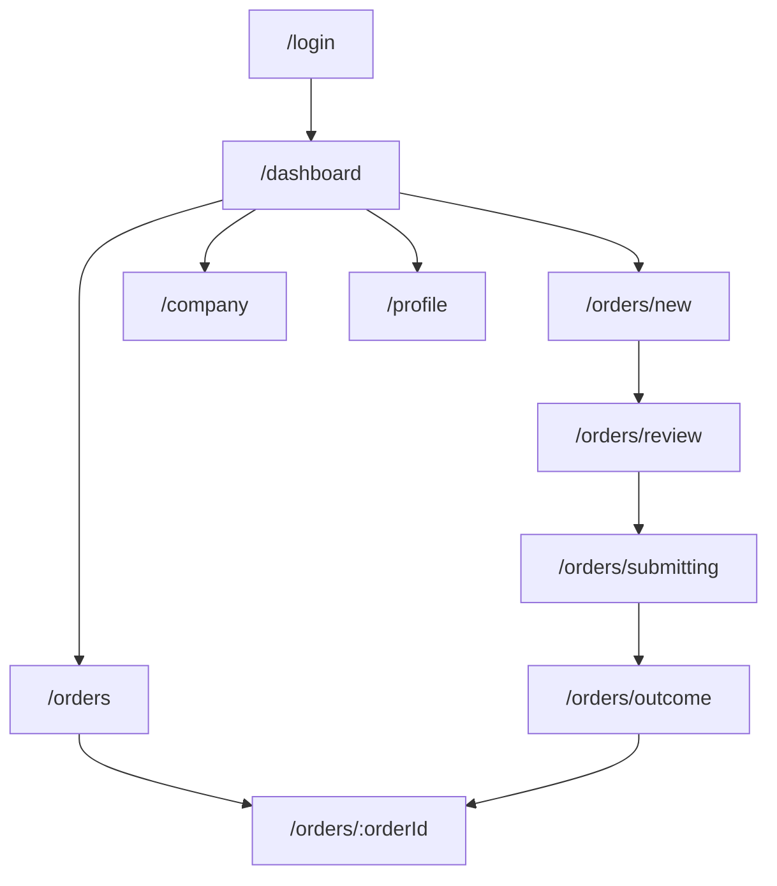

# Arbitrier Customer Portal: UX Strategy & Information Architecture

## 1. Project Overview
Arbitrier is a B2B order orchestration platform. The goal of this exploration is to design a high-confidence, transparent purchasing experience for corporate agents, completely abstracting the underlying distributed systems (Sagas, Kafka, etc.).

## 2. Navigation Map
The navigation is kept minimal and focused on the purchasing agent's primary workflows.

- **Dashboard (Home)**: High-level overview of company health, credit, and active orders.
- **Orders**: Full history and detailed tracking of all company purchases.
- **New Order (CTA)**: Primary entry point for the search-driven purchasing workflow.
- **Company**: Corporate profile, billing details, and credit management.
- **Profile**: Personal user settings and notification preferences.

This map describes the implemented Customer Portal prototype. A future operations/admin console is a separate application concern; it is not part of ARB-UI-001 and must not be inferred from customer routes.

## 3. User Flow: The "Purchase to Outcome" Journey
1. **Authentication**: Corporate login presentation; authentication is mocked in the prototype and will later integrate with Keycloak.
2. **Dashboard**: Agent lands on the home screen, checks available credit, and clicks "New Order."
3. **Drafting**: Search and add products/quantities. No technical SKUs; focus on product names.
4. **Availability Review (The "Negotiation" Phase)**: The system presents global inventory availability. The user resolves any partial availability issues.
5. **Submission**: Order is submitted. The UI shows business-level progress (Inventory, Credit, Preparation).
6. **Result**: Final confirmation or clear rejection with actionable next steps.
7. **Tracking**: Detailed business timeline of the order's lifecycle.

## 4. Design Rationale
- **Abstraction of Complexity**: We replace technical states (Saga started, Compensation triggered) with business milestones (Order prepared, Credit approved).
- **Confidence through Transparency**: In the B2B space, knowing *why* an order is partial (Inventory availability) is more important than knowing *how* it was calculated.
- **Action-Oriented Design**: Every screen has a clear primary action, reducing cognitive load for busy purchasing agents.
- **Professional Aesthetics**: A "Modern SaaS" look—clean, high-contrast, and data-rich without being cluttered.

## 5. UI Component Suggestions
- **Business Timeline**: A vertical stepper showing business events, not system logs.
- **Availability Matrix**: A clear table for comparing "Requested" vs. "Available" quantities during the review phase.
- **Credit Progress Bar**: A visual indicator of available vs. used company credit.
- **Global Search-to-Cart**: An omnibar-style search that allows adding products directly to a draft order.

## 6. Implementation Status

The routes and business journey above are implemented in React using typed service interfaces and localStorage-backed mocks. Credit, products, availability, submission progress, and outcomes are synthetic. Real API calls, Keycloak login, live saga status, invoice downloads, and an Admin Console remain future work.
